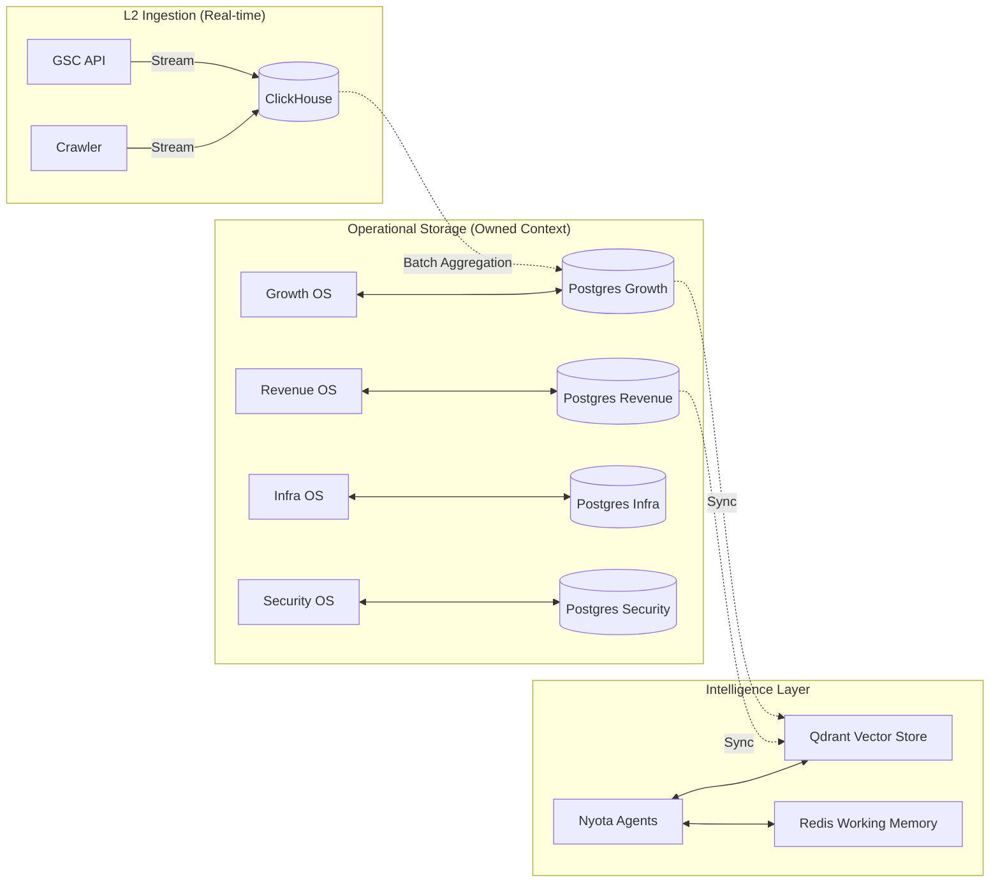

# Nyota v2 System Specification: Data Architecture
## Persistent Layer & Data Ownership Model

### 1. Technology Stack
The architecture follows a "Right Tool for the Job" strategy:

*   **Operational DB (PostgreSQL):** Transactional truth for orders, leads, and state.
*   **Analytics DB (ClickHouse):** High-speed ingestion for crawler logs, SERP histories, and metrics.
*   **Vector DB (Qdrant):** Long-term semantic memory and similarity search for agents.
*   **Cache / Buffer (Redis):** Working state, chat sessions, and NATS JetStream buffer.

---

### 2. Data Ownership Boundaries

Each OS owns its schema. While data is readable across domains via the Read API (read-only), only the owning OS may issue `INSERT/UPDATE/DELETE` commands.

#### 2.1 Growth OS (Namespaced Schema)
*   **Owned Tables:** `keywords`, `content_library`, `serp_snapshots`, `crawler_logs`.
*   **Ownership:** Musa (SEO) and Zuri (Crawler) manage this data.
*   **Vector Collection:** `growth.research` (Competitor extraction), `growth.semantic_content`.

#### 2.2 Revenue OS (Namespaced Schema)
*   **Owned Tables:** `inventory`, `customer_crm`, `whatsapp_conversations`, `lead_pipeline`, `roi_audit`.
*   **Ownership:** Nia (Sales) and GPU Arbitrage agents.
*   **Compliance:** PII (Personally Identifiable Information) encryption at rest mandatory for CRM.

#### 2.3 Infrastructure OS (Namespaced Schema)
*   **Owned Tables:** `deployments`, `server_inventory`, `uptime_log`, `backup_registry`.
*   **Ownership:** Jarvis (SRE).
*   **Metrics:** Writes to ClickHouse for long-term health trends.

#### 2.4 Security OS (Namespaced Schema)
*   **Owned Tables:** `audit_logs`, `blocked_entities`, `incident_registry`, `threat_signals`.
*   **Ownership:** Baraka (Security).
*   **Privacy:** High-security logs with immutable write-ahead logging (WAL).

---

### 3. Data Flow Diagram

---

### 4. Replication & Backup Policies

*   **Operational DB (PostgreSQL):**
    *   **Strategy:** Point-in-Time Recovery (PITR) with WAL archiving.
    *   **Frequency:** Continuous WAL shipping + Full daily snapshots.
    *   **Target:** Encrypted S3 bucket.
*   **Analytics DB (ClickHouse):**
    *   **Strategy:** Periodic snapshots. High-volume raw logs discarded after 90 days.
*   **Vector Store (Qdrant):**
    *   **Strategy:** Snapshots every 6 hours.

---

### 5. Retention & Purge Policies

| Data Type | Retention | Policy |
| :--- | :--- | :--- |
| `Audit Logs` | 1 Year | Legal / Security requirement. Move to cold storage after 6 months. |
| `Crawler Raw HTML` | 30 Days | High space usage, purge after extraction. |
| `Keyword Positions` | Permanent | Required for long-term trend analysis. |
| `CRM Data` | Permanent | Unless GDPR/Right-to-be-forgotten request received. |
| `NATS Event History` | 7 Days | JetStream retention for replay / retry. |

