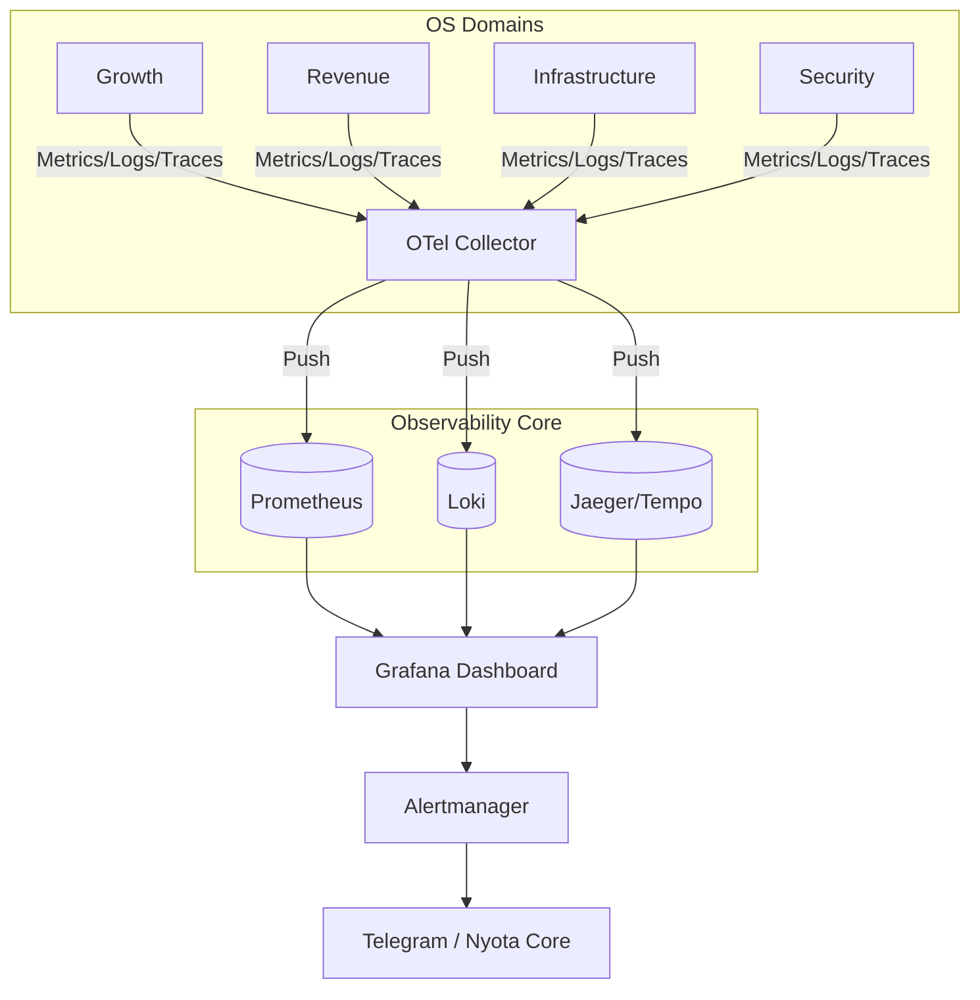

# Nyota v2 System Specification: Observability Stack
## Monitoring, Logging, and Tracing Architecture

### 1. Specification Overview
As a distributed system comprised of 4 independent Operating Systems and an Orchestration Core, Nyota v2 requires a "Single Pane of Glass" observability strategy. This specification establishes the **LGTM Stack** (Loki, Grafana, Tempo, Prometheus) as the standard for monitoring the distributed swarm.

---

### 2. The Observability Pillars

| Pillar | Technology | Scope |
| :--- | :--- | :--- |
| **Metrics** | Prometheus / VictoriaMetrics | CPU/RAM, Event Bus throughput, Agent success rates, Inventory value. |
| **Logs** | Grafana Loki | Structured JSON logs from all OS containers, system logs, and security audits. |
| **Tracing** | Jaeger (or Grafana Tempo) | End-to-end event lifecycles across domain boundaries using Trace-IDs. |
| **Visualization** | Grafana | Unified dashboards, alerting rules, and operator views. |

---

### 3. Collection Architecture

#### 3.1 Metric Ingestion (Pull/Push)
*   **Domain OS Metrics:** Every OS exposes a `/metrics` endpoint for Prometheus scraping.
*   **Ephemeral Agents:** Short-lived agent tasks use the **Prometheus Pushgateway** to report results before exiting.
*   **NATS Metrics:** Prometheus scrapes the NATS monitoring endpoint (port 8222) to track bus health.

#### 3.2 Log Ingestion (Push)
*   **Promtail:** Runs as a sidecar or Docker plugin on the VPS, capturing stdout/stderr and pushing to the central Loki instance.
*   **Labels:** Every log line must be tagged with `os_domain`, `agent_name`, and `trace_id`.

#### 3.3 Trace Instrumentation (OpenTelemetry)
*   **Auto-Instrumentation:** All Python/JS agent services use OpenTelemetry (OTel) exporters.
*   **Context Propagation:** When an agent publishes a NATS event, it *must* include the `trace_id` in the event header to allow Jaeger to link the cause (Growth OS) to the effect (Revenue OS).

---

### 4. Domain-Specific Monitoring Requirements

| OS Domain | Primary KPI | Alert Condition |
| :--- | :--- | :--- |
| **Growth OS** | SERP Visibility Index | SEO Ranking drop > 20% |
| **Revenue OS** | Conversion Velocity | 0 Leads captured in 24h (High traffic) |
| **Infrastructure OS** | Resource Utilization | RAM usage > 85% on production node |
| **Security OS** | Intrusion Signal Count | > 10 Failed SSH/Admin attempts / 1m |

---

### 5. Alerting & Notification Flow

The **Alertmanager** handles deduplication and routing:

1.  **Level 1: Normal (Dashboard Only)** - Minor drifts, non-critical errors.
2.  **Level 2: Warning (Telegram)** - Approvals needed, unusual ranking moves, high latency.
3.  **Level 3: Critical (Telegram + Immediate Agent Action)** - Service down, Security breach, Infrastructure failure.

---

### 6. Observability Flow Diagram

