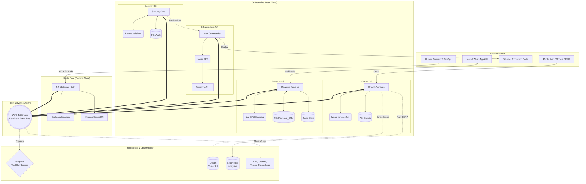
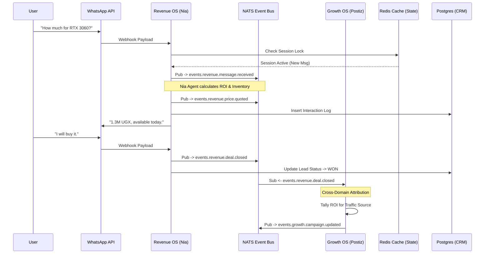
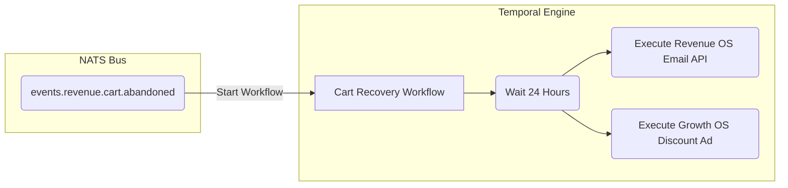

# Nyota v2 System Specification: Reference Architecture
## Full Enterprise Topology & Message Routing

### 1. Conceptual Topology Map
The Nyota v2 system separates business capabilities into bounded contexts (Operating Systems). No context has direct access to another's memory space.

---

### 2. Message Flow Diagram: The Complete Profit Loop
This diagram traces a standard user journey from Top-of-Funnel (Growth) to Bottom-of-Funnel (Revenue) and highlights how the distributed components handle the flow asynchronously.

---

### 3. Service Boundaries & Responsibilities Matrix

A strict matrix to enforce architectural discipline. If a new script or capability is developed, it must be assigned to one of these boundaries.

| OS Domain | Component Category | Permitted Actions | Blocked Actions |
| :--- | :--- | :--- | :--- |
| **Growth OS** | Crawlers, SEO Agents, Markdown Gens | Write to `growth` schema, Trigger PRs (via NATS), Ping Google APIs | Write to CRM, Access WhatsApp webhook, Alter Infrastructure |
| **Revenue OS** | Chatbots, Email Senders, Discount Engines | Write to `revenue` schema, Reply to WhatsApp, Read Inventory | Modify frontend code, Deploy servers, Scrape Google |
| **Security OS** | Intrusion Scanners, NGINX Configs, JWT Validation | Drop packets, Block incoming NATS events, Read audit logs | Write articles, Send emails to users |
| **Infrastructure OS** | Terraform, Docker Daemons, Cron | Provision VMs, Run GitHub Actions, Restart crashed containers | Read user chat logs, Modify marketing content |
| **Core (Orchestrator)** | API Gateway, Human Dashboard | Route mTLS traffic, Escalate alerts to Telegram, Issue mTLS certs | Run crawlers, Run Terraform, Run chat loops |

---

### 4. Advanced: Temporal Workflow Integration

For complex stateful logic spanning days (e.g., Cart Abandonment), the system relies on Temporal, which abstracts over the NATS bus.

