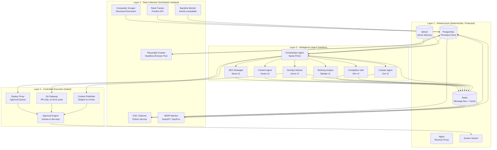

# NYOTA v2 — WORLD-CLASS AUTONOMOUS SEO SYSTEM

## Complete Architecture Blueprint

> **System Name:** Nyota v2  
> **Version:** 2.0.0  
> **Classification:** Production-Grade Autonomous SEO Intelligence Platform  
> **Design Standard:** SaaS-Level, Dockerized, Multi-Agent, Safe-by-Design

---

## AUDIT FINDINGS — What Broke and Why

Before the design, here is the honest post-mortem of v1.

| Failure Category            | Root Cause                                                                                        | Severity |
| --------------------------- | ------------------------------------------------------------------------------------------------- | -------- |
| **No persistent memory**    | Memory lived in flat `.md` files synced via git. Session changes got lost or overwrote each other | Critical |
| **Uncontrolled git ops**    | Agents had direct `git push` access to production repos. One bad commit = silent damage           | Critical |
| **No layer isolation**      | AI reasoning and infrastructure execution ran in the same process space                           | Critical |
| **Monolithic agent**        | "Nyota" was one agent doing everything. No specialist depth, no parallelism                       | High     |
| **No structured messaging** | Agents communicated by writing markdown files to disk. Race conditions, no schema                 | High     |
| **No rollback**             | `snapshot-pre.sh` was a good idea but never wired into the critical path                          | High     |
| **Bash scripts as agents**  | `seo-monitor.sh` had placeholder Python. It never actually queried GSC                            | Medium   |
| **No observability**        | Health checks wrote to `/opt/nyota/logs/` but nothing read them                                   | Medium   |
| **SSH keys in workspace**   | `.ssh/` directory committed alongside `SOUL.md`                                                   | Critical |

**Conclusion:** The cognitive system (SOUL.md, DECISION_ENGINE.md, INSTINCTS.md) was architecturally excellent — policy-grade documentation. The execution layer was brittle shell scripts. The gap between the two destroyed the system.

**Salvageable components:**

- All of: `SOUL.md`, `VALUES.md`, `INSTINCTS.md`, `DECISION_ENGINE.md`, `PLANNING_ENGINE.md`, `SELF_IMPROVEMENT.md` → Port verbatim as agent system prompts
- `safe-exec.sh` → Promote to core safety middleware
- Agent roles in `nyota-team/COORDINATION.md` → Expanded into v2 specialist team
- SEO content in `genuinetechug/` → Seed content for v2 content engine
- `auto-sitemap.sh` logic → Port to Python, wire into pipeline

---

## SYSTEM OVERVIEW

```
┌─────────────────────────────────────────────────────────────────────┐
│                         NYOTA v2 SYSTEM                             │
│                                                                     │
│  ┌─────────────────────────────────────────────────────────────┐   │
│  │  LAYER 4 — CONTROLLED EXECUTION                             │   │
│  │  Git Gateway │ Deploy Proxy │ Content Publisher │ Approvals  │   │
│  └──────────────────────┬──────────────────────────────────────┘   │
│                         │ structured commands only                  │
│  ┌──────────────────────▼──────────────────────────────────────┐   │
│  │  LAYER 3 — INTELLIGENCE (Agent Sandbox)                     │   │
│  │  Orchestrator │ SEO Strategist │ Crawler │ Content │ Ranker  │   │
│  │  Competitor Intel │ DevOps Advisor │ Analyst                 │   │
│  └──────────────────────┬──────────────────────────────────────┘   │
│                         │ read-only data access                    │
│  ┌──────────────────────▼──────────────────────────────────────┐   │
│  │  LAYER 2 — DATA COLLECTION                                  │   │
│  │  GSC Collector │ Crawler Engine │ Competitor Scraper         │   │
│  │  Rank Tracker │ SERP Monitor │ Backlink Analyzer             │   │
│  └──────────────────────┬──────────────────────────────────────┘   │
│                         │ stores to persistent store               │
│  ┌──────────────────────▼──────────────────────────────────────┐   │
│  │  LAYER 1 — INFRASTRUCTURE                                   │   │
│  │  PostgreSQL │ Redis │ Qdrant │ Nginx │ VPS │ Docker Swarm    │   │
│  └─────────────────────────────────────────────────────────────┘   │
└─────────────────────────────────────────────────────────────────────┘
```

**The inviolable rule:** AI agents exist ONLY in Layer 3. They cannot reach Layer 1 directly. Every output routes through Layer 4's approval/execution gateway.

---

## DELIVERABLE 1 — FULL SYSTEM ARCHITECTURE DIAGRAM



---

## DELIVERABLE 2 — REPOSITORY STRUCTURE

```
nyota-v2/
│
├── 📁 infrastructure/                   # Layer 1 — never touched by agents
│   ├── docker/
│   │   ├── docker-compose.yml           # Full stack definition
│   │   ├── docker-compose.dev.yml       # Local overrides
│   │   └── docker-compose.prod.yml      # Production overrides
│   ├── nginx/
│   │   ├── nginx.conf
│   │   └── sites/
│   │       ├── api.conf
│   │       └── dashboard.conf
│   ├── postgres/
│   │   ├── init.sql                     # Schema initialization
│   │   └── migrations/                  # Alembic migrations
│   └── scripts/
│       ├── bootstrap.sh                 # One-time VPS setup
│       ├── backup.sh                    # Encrypted backup to S3
│       └── restore.sh
│
├── 📁 collectors/                       # Layer 2 — data ingestion services
│   ├── gsc/
│   │   ├── Dockerfile
│   │   ├── main.py                      # GSC API → PostgreSQL
│   │   ├── auth.py                      # OAuth2 flow
│   │   └── schema.py
│   ├── crawler/
│   │   ├── Dockerfile
│   │   ├── main.py                      # Playwright headless pool
│   │   ├── extractors/
│   │   │   ├── seo_signals.py
│   │   │   ├── competitor_prices.py
│   │   │   └── serp_extractor.py
│   │   └── queue.py                     # Redis queue consumer
│   ├── rank_tracker/
│   │   ├── Dockerfile
│   │   └── main.py                      # Keyword position tracking
│   └── backlink_monitor/
│       ├── Dockerfile
│       └── main.py
│
├── 📁 intelligence/                     # Layer 3 — the agent sandbox
│   ├── core/
│   │   ├── base_agent.py                # Abstract agent class
│   │   ├── memory.py                    # Qdrant + PostgreSQL memory interface
│   │   ├── message_bus.py               # Redis pub/sub wrapper
│   │   ├── model_router.py              # LLM routing (local → cloud fallback)
│   │   └── safety.py                   # Command validation layer
│   ├── agents/
│   │   ├── orchestrator/
│   │   │   ├── Dockerfile
│   │   │   ├── main.py
│   │   │   └── prompts/
│   │   │       └── system.md            # Nyota Prime's identity (from SOUL.md)
│   │   ├── seo_strategist/              # Musa v2
│   │   │   ├── Dockerfile
│   │   │   ├── main.py
│   │   │   └── prompts/system.md
│   │   ├── content_agent/              # Amani v2
│   │   │   ├── Dockerfile
│   │   │   ├── main.py
│   │   │   └── prompts/system.md
│   │   ├── competitor_intel/           # Kito v2
│   │   │   ├── Dockerfile
│   │   │   ├── main.py
│   │   │   └── prompts/system.md
│   │   ├── ranking_analyst/            # Baraka v2
│   │   │   ├── Dockerfile
│   │   │   ├── main.py
│   │   │   └── prompts/system.md
│   │   ├── crawler_agent/              # Zuri v2
│   │   │   ├── Dockerfile
│   │   │   ├── main.py
│   │   │   └── prompts/system.md
│   │   └── devops_advisor/             # Jarvis v2
│   │       ├── Dockerfile
│   │       ├── main.py
│   │       └── prompts/system.md
│   └── shared/
│       ├── schemas.py                   # Pydantic message schemas
│       ├── tools.py                     # Tool registry
│       └── constants.py
│
├── 📁 execution/                        # Layer 4 — the controlled gateway
│   ├── git_gateway/
│   │   ├── Dockerfile
│   │   ├── main.py                      # FastAPI — PR creation only
│   │   └── safety.py                   # Destructive command blocklist
│   ├── deploy_proxy/
│   │   ├── Dockerfile
│   │   └── main.py                      # Approval queue + webhook
│   ├── content_publisher/
│   │   ├── Dockerfile
│   │   └── main.py                      # Content scheduler + approval
│   └── approval_engine/
│       ├── Dockerfile
│       ├── main.py                      # Human-in-the-loop API
│       └── webhooks.py                  # Telegram/WhatsApp notifications
│
├── 📁 dashboard/                        # Operator UI
│   ├── Dockerfile
│   ├── package.json
│   └── src/
│       ├── app/
│       │   ├── page.tsx                 # Overview
│       │   ├── rankings/page.tsx
│       │   ├── content/page.tsx
│       │   ├── agents/page.tsx
│       │   └── approvals/page.tsx
│       └── components/
│
├── 📁 shared/                           # Cross-service schemas and config
│   ├── schemas/
│   │   ├── messages.py                  # Agent message envelope
│   │   ├── seo_signals.py
│   │   └── tasks.py
│   └── config/
│       ├── model_routing.yaml           # Port of model-routing.md
│       └── agent_schedule.yaml
│
├── 📁 identity/                         # Agent identity files (READ-ONLY to agents)
│   ├── SOUL.md                          # Ported verbatim from v1
│   ├── VALUES.md
│   ├── INSTINCTS.md
│   ├── DECISION_ENGINE.md
│   ├── PLANNING_ENGINE.md
│   └── SELF_IMPROVEMENT.md
│
├── 📁 docs/
│   ├── architecture.md                  # This document
│   ├── onboarding.md
│   └── runbooks/
│       ├── incident-response.md
│       └── agent-debugging.md
│
├── .env.example                         # Template — secrets never committed
├── Makefile                             # All ops commands
└── README.md
```

---

## DELIVERABLE 3 — DOCKER ARCHITECTURE

```yaml
# docker-compose.yml (abridged — full version in infrastructure/docker/)

version: "3.9"

networks:
  nyota-internal: # Layer 1 ↔ Layer 2 only
    driver: bridge
  agent-bus: # Layer 3 internal
    driver: bridge
  execution-gate: # Layer 3 → Layer 4 (one-way, no return path to infra)
    driver: bridge

volumes:
  postgres-data:
  qdrant-data:
  redis-data:

services:
  # ═══════════════════════════════════════════
  # LAYER 1 — INFRASTRUCTURE
  # ═══════════════════════════════════════════

  postgres:
    image: postgres:16-alpine
    networks: [nyota-internal]
    volumes: [postgres-data:/var/lib/postgresql/data]
    environment:
      POSTGRES_DB: nyota
      POSTGRES_USER: nyota
      POSTGRES_PASSWORD: ${POSTGRES_PASSWORD}
    healthcheck:
      test: ["CMD", "pg_isready", "-U", "nyota"]
      interval: 10s

  redis:
    image: redis:7-alpine
    networks: [nyota-internal, agent-bus]
    volumes: [redis-data:/data]
    command: redis-server --appendonly yes --requirepass ${REDIS_PASSWORD}

  qdrant:
    image: qdrant/qdrant:v1.8.0
    networks: [nyota-internal, agent-bus]
    volumes: [qdrant-data:/qdrant/storage]
    environment:
      QDRANT__SERVICE__API_KEY: ${QDRANT_API_KEY}

  # ═══════════════════════════════════════════
  # LAYER 2 — COLLECTORS
  # ═══════════════════════════════════════════

  gsc-collector:
    build: ./collectors/gsc
    networks: [nyota-internal]
    depends_on: [postgres, redis]
    environment:
      GSC_CREDENTIALS_JSON: ${GSC_CREDENTIALS_JSON}
      GSC_SITE_URL: ${GSC_SITE_URL}
    restart: unless-stopped

  crawler:
    build: ./collectors/crawler
    networks: [nyota-internal]
    deploy:
      replicas: 2 # Horizontal scaling for crawl throughput
    cap_drop: [ALL] # No root capabilities
    cap_add: [NET_BIND_SERVICE]
    security_opt: [no-new-privileges:true]

  rank-tracker:
    build: ./collectors/rank_tracker
    networks: [nyota-internal]
    environment:
      SERPAPI_KEY: ${SERPAPI_KEY}

  # ═══════════════════════════════════════════
  # LAYER 3 — INTELLIGENCE (Network Isolated)
  # ═══════════════════════════════════════════
  # Agents connect to agent-bus (Redis + Qdrant)
  # They CANNOT reach postgres directly or nyota-internal

  orchestrator:
    build: ./intelligence/agents/orchestrator
    networks: [agent-bus, execution-gate] # Bridge between L3 and L4
    environment:
      OPENAI_API_KEY: ${OPENAI_API_KEY}
      ANTHROPIC_API_KEY: ${ANTHROPIC_API_KEY}
      OLLAMA_HOST: ${OLLAMA_HOST}
      REDIS_URL: redis://:${REDIS_PASSWORD}@redis:6379
      QDRANT_URL: http://qdrant:6333
      QDRANT_KEY: ${QDRANT_API_KEY}
    depends_on: [redis, qdrant]

  seo-strategist:
    build: ./intelligence/agents/seo_strategist
    networks: [agent-bus]
    environment:
      REDIS_URL: redis://:${REDIS_PASSWORD}@redis:6379
      QDRANT_URL: http://qdrant:6333
      QDRANT_KEY: ${QDRANT_API_KEY}
      OPENAI_API_KEY: ${OPENAI_API_KEY}

  content-agent:
    build: ./intelligence/agents/content_agent
    networks: [agent-bus]
    environment:
      REDIS_URL: redis://:${REDIS_PASSWORD}@redis:6379
      OPENAI_API_KEY: ${OPENAI_API_KEY}
      ANTHROPIC_API_KEY: ${ANTHROPIC_API_KEY}

  competitor-intel:
    build: ./intelligence/agents/competitor_intel
    networks: [agent-bus]

  ranking-analyst:
    build: ./intelligence/agents/ranking_analyst
    networks: [agent-bus]

  devops-advisor:
    build: ./intelligence/agents/devops_advisor
    networks: [agent-bus, execution-gate]

  # ═══════════════════════════════════════════
  # LAYER 4 — EXECUTION GATEWAY (Gated)
  # ═══════════════════════════════════════════

  git-gateway:
    build: ./execution/git_gateway
    networks: [execution-gate]
    environment:
      GITHUB_TOKEN: ${GITHUB_TOKEN}
      ALLOWED_REPOS: ${ALLOWED_REPOS} # Whitelist only
      GIT_NO_FORCE_PUSH: "true"
      REQUIRE_PR: "true" # All changes via PRs
    volumes:
      - ./execution/git_gateway/blocklist.txt:/app/blocklist.txt:ro

  approval-engine:
    build: ./execution/approval_engine
    networks: [execution-gate]
    environment:
      TELEGRAM_BOT_TOKEN: ${TELEGRAM_BOT_TOKEN}
      OPERATOR_CHAT_ID: ${OPERATOR_CHAT_ID}
      AUTO_APPROVE_BELOW_RISK: "LOW" # Only approve LOW risk automatically

  content-publisher:
    build: ./execution/content_publisher
    networks: [execution-gate]

  # ═══════════════════════════════════════════
  # DASHBOARD
  # ═══════════════════════════════════════════

  dashboard:
    build: ./dashboard
    networks: [nyota-internal, execution-gate]
    ports: ["3000:3000"]

  nginx:
    image: nginx:alpine
    ports: ["80:80", "443:443"]
    networks: [nyota-internal]
    volumes:
      - ./infrastructure/nginx/nginx.conf:/etc/nginx/nginx.conf:ro
```

**Network Security Model:**

- Layer 3 agents sit on `agent-bus` only. They **cannot** resolve `postgres` hostname.
- Agents interact with data exclusively through a **Read API** — a thin FastAPI service that provides read-only projections from PostgreSQL over HTTPS.
- Only the Git Gateway and Approval Engine have outbound internet access. All other containers have `--no-internet` (achieved via iptables rules in bootstrap.sh).

---

## DELIVERABLE 4 — MEMORY SYSTEM DESIGN

The v1 system's fatal flaw was treating git commits as memory. v2 uses three distinct memory stores, each purpose-built.

### Memory Architecture

```
┌────────────────────────────────────────────────────────┐
│                   MEMORY SYSTEM v2                     │
│                                                        │
│  ┌─────────────────┐  ┌──────────────┐  ┌──────────┐  │
│  │    EPISODIC      │  │  SEMANTIC    │  │ WORKING  │  │
│  │   PostgreSQL     │  │   Qdrant     │  │  Redis   │  │
│  │                  │  │              │  │          │  │
│  │ Every agent run  │  │ Embeddings   │  │ Current  │  │
│  │ Input / Output   │  │ of all       │  │ task     │  │
│  │ Decisions made   │  │ research,    │  │ context  │  │
│  │ Outcomes         │  │ content,     │  │ Agent    │  │
│  │ Errors           │  │ SERP data    │  │ state    │  │
│  └─────────────────┘  └──────────────┘  └──────────┘  │
└────────────────────────────────────────────────────────┘
```

### PostgreSQL Schema (Episodic Memory)

```sql
-- Agent execution log — every run recorded
CREATE TABLE agent_runs (
    id              UUID PRIMARY KEY DEFAULT gen_random_uuid(),
    agent_name      TEXT NOT NULL,
    task_type       TEXT NOT NULL,
    input_context   JSONB,
    output          JSONB,
    decision_trail  JSONB,       -- Scored options + chosen action
    success         BOOLEAN,
    error_message   TEXT,
    duration_ms     INTEGER,
    model_used      TEXT,
    tokens_used     INTEGER,
    created_at      TIMESTAMPTZ DEFAULT NOW()
);

-- SEO state — ground truth rankings
CREATE TABLE keyword_positions (
    id              UUID PRIMARY KEY DEFAULT gen_random_uuid(),
    site_url        TEXT NOT NULL,
    keyword         TEXT NOT NULL,
    position        DECIMAL(6,1),
    impressions     INTEGER,
    clicks          INTEGER,
    ctr             DECIMAL(5,4),
    date            DATE NOT NULL,
    source          TEXT DEFAULT 'gsc',
    created_at      TIMESTAMPTZ DEFAULT NOW()
);

-- Content registry
CREATE TABLE content_items (
    id              UUID PRIMARY KEY DEFAULT gen_random_uuid(),
    title           TEXT NOT NULL,
    slug            TEXT UNIQUE,
    content_type    TEXT,               -- article, landing_page, faq
    target_keywords TEXT[],
    status          TEXT DEFAULT 'draft',  -- draft, pending_approval, published
    word_count      INTEGER,
    seo_score       DECIMAL(4,1),
    created_by      TEXT,               -- which agent
    approved_by     TEXT,               -- human or auto
    published_at    TIMESTAMPTZ,
    created_at      TIMESTAMPTZ DEFAULT NOW()
);

-- Competitor intelligence
CREATE TABLE competitor_signals (
    id              UUID PRIMARY KEY DEFAULT gen_random_uuid(),
    competitor_url  TEXT NOT NULL,
    signal_type     TEXT,               -- price_change, new_content, ranking_move
    data            JSONB,
    detected_at     TIMESTAMPTZ DEFAULT NOW()
);

-- Approval queue — human review
CREATE TABLE pending_actions (
    id              UUID PRIMARY KEY DEFAULT gen_random_uuid(),
    action_type     TEXT NOT NULL,      -- git_commit, content_publish, deploy
    requested_by    TEXT,               -- agent name
    payload         JSONB NOT NULL,
    risk_level      TEXT DEFAULT 'MEDIUM',
    status          TEXT DEFAULT 'pending',
    reviewed_by     TEXT,
    reviewed_at     TIMESTAMPTZ,
    created_at      TIMESTAMPTZ DEFAULT NOW()
);

-- Agent communication log
CREATE TABLE message_log (
    id              UUID PRIMARY KEY DEFAULT gen_random_uuid(),
    channel         TEXT NOT NULL,
    sender          TEXT NOT NULL,
    message_type    TEXT NOT NULL,
    payload         JSONB,
    created_at      TIMESTAMPTZ DEFAULT NOW()
);
```

### Qdrant Collections (Semantic Memory)

```python
# Collections created at bootstrap
QDRANT_COLLECTIONS = {
    "research": {             # All crawled + analyzed content
        "vector_size": 1536,
        "distance": "Cosine"
    },
    "content_library": {      # All generated + published content
        "vector_size": 1536,
        "distance": "Cosine"
    },
    "serp_patterns": {        # SERP result patterns by keyword
        "vector_size": 1536,
        "distance": "Cosine"
    },
    "agent_knowledge": {      # Agent-generated insights and strategies
        "vector_size": 1536,
        "distance": "Cosine"
    }
}
```

### Redis Channels (Working Memory + Bus)

```
nyota:tasks:queue          → Priority task queue (ZSET by score)
nyota:agents:{name}:inbox  → Per-agent message inbox (LIST)
nyota:agents:{name}:state  → Current agent state (HASH)
nyota:broadcast            → System-wide announcements (PUBSUB)
nyota:alerts               → Priority alerts for operator (LIST)
nyota:locks:{resource}     → Distributed locks (SET with TTL)
nyota:cache:gsc:{key}      → GSC data cache (STRING with TTL 3600)
nyota:cache:serp:{key}     → SERP data cache (STRING with TTL 900)
```

---

## DELIVERABLE 5 — AGENT TEAM ROLES

### Agent Message Schema (Pydantic)

```python
class AgentMessage(BaseModel):
    id: str = Field(default_factory=lambda: str(uuid4()))
    sender: str                    # agent name
    recipient: str                 # agent name or "broadcast"
    message_type: str              # task_request | report | alert | data
    priority: int = 5              # 1=critical, 10=background
    payload: dict
    requires_response: bool = False
    reply_to: Optional[str] = None
    created_at: datetime = Field(default_factory=datetime.utcnow)
    ttl_seconds: int = 3600
```

---

### Agent 1: NYOTA PRIME (Orchestrator)

**Identity:** The intelligence center. Thinks strategically, not operationally.

**Responsibilities:**

- Reads system state every cycle
- Generates the weekly SEO growth plan
- Routes tasks to specialist agents
- Evaluates reports from sub-agents
- Decides which actions are worth taking
- Routes approved decisions to Layer 4

**Decision Framework:** Runs the full `DECISION_ENGINE.md` scoring model before every action dispatch.

**Triggers:**

- Scheduled: Every 6 hours weekdays, every 12 hours weekends
- Event-driven: On any alert from sub-agents

**Never does:**

- Execute git operations directly
- Make HTTP calls to external services
- Touch the database directly

---

### Agent 2: MUSA v2 (SEO Strategist)

**Identity:** Former Musa + upgraded with full GSC data access and SERP intelligence.

**Responsibilities:**

- Reads GSC data from PostgreSQL (via Read API)
- Analyzes keyword ranking trends
- Identifies ranking opportunities (low competition, high intent)
- Drafts monthly SEO strategy documents
- Detects ranking drops and triggers alerts
- Generates content briefs with keyword clusters

**Key improvement over v1:** Musa v1 wrote placeholder text. Musa v2 only runs when real GSC data exists in the database. If no data → emits `DATA_UNAVAILABLE` signal to orchestrator, never fabricates.

**Outputs:**

- `seo_strategy_report` → stored in PostgreSQL + Qdrant
- `content_brief` → sent to Amani v2
- `ranking_alert` → sent to Orchestrator when position drops >5

---

### Agent 3: AMANI v2 (Content Generation Agent)

**Identity:** Senior content strategist with SEO depth. Never publishes without approval.

**Responsibilities:**

- Receives content briefs from Musa v2
- Generates full-length, SEO-optimized articles
- Calculates an internal SEO score before submitting
- Stores draft in PostgreSQL with `status: draft`
- Submits to content publisher for human review
- Never publishes autonomously

**Content Standards:**

- Minimum 1,200 words for articles
- Semantic keyword coverage (LSI terms from Qdrant context)
- Schema markup JSON-LD generated alongside
- Internal linking suggestions
- Meta title + description + OG tags included

**Outputs:**

- Content package (HTML + frontmatter) → `content_items` table
- Approval request → `pending_actions` table

---

### Agent 4: ZURI v2 (Crawler Agent)

**Identity:** Data acquisition specialist. Methodical, never overloads targets.

**Responsibilities:**

- Manages the Playwright crawler pool
- Crawls competitor product pages on schedule
- Extracts pricing, product attributes, meta data
- Validates extraction quality before storing
- Respects `robots.txt` by default
- Rate-limits all crawls (max 10 req/min per domain)

**Rate limiting strategy:**

```python
CRAWL_POLICIES = {
    "default": {"delay_ms": 2000, "max_concurrent": 2},
    "aggressive": {"delay_ms": 500, "max_concurrent": 5},   # opt-in only
    "respectful": {"delay_ms": 5000, "max_concurrent": 1},  # new domains
}
```

**Outputs:**

- Raw signals → `competitor_signals` table
- Alert on >15% competitor price change → Orchestrator

---

### Agent 5: BARAKA v2 (Ranking Analyst)

**Identity:** Data scientist mentality. Pattern recognition, trend detection, anomaly flagging.

**Responsibilities:**

- Analyzes position data from `keyword_positions`
- Detects ranking trends (up/down/stagnant)
- Correlates content changes with ranking movements
- Generates weekly ranking performance reports
- Identifies keyword cannibalization
- Flags pages that need SEO intervention

**Outputs:**

- `ranking_report` → Orchestrator weekly
- `intervention_needed` alert → for pages declining >20% over 2 weeks

---

### Agent 6: KITO v2 (Competitor Intelligence)

**Identity:** Former DevOps agent. Now a dedicated competitive intelligence specialist.

**Responsibilities:**

- Tracks competitor landing pages for structural changes
- Monitors competitor keyword gains via SERP data
- Identifies competitor backlink acquisition patterns
- Summarizes competitive landscape weekly
- Flags market opportunities (competitor gaps)

**Outputs:**

- `competitive_landscape_report` → Orchestrator weekly

---

### Agent 7: JARVIS v2 (DevOps Advisor)

**Identity:** Infrastructure guardian. Recommends, never executes unilaterally.

**Responsibilities:**

- Monitors system metrics (via Prometheus API — read-only)
- Identifies performance bottlenecks
- Recommends infrastructure changes
- Submits deployment recommendations to Approval Engine
- Monitors website uptime and Core Web Vitals
- Generates monthly infrastructure health reports

**Key constraint:** JARVIS can only submit `deploy_recommendation` to the Approval Engine. It cannot touch Docker, Nginx, or any infrastructure component directly. The human must approve every infrastructure change.

---

## DELIVERABLE 6 — SEO AUTOMATION PIPELINE

```
DISCOVERY CYCLE (continuous)
─────────────────────────────
GSC Collector (L2) ──→ keyword_positions table
SERP Monitor (L2) ──→ competitor ranking data
Rank Tracker (L2) ──→ daily position snapshots

ANALYSIS CYCLE (every 6 hours)
───────────────────────────────
Baraka v2 reads ranking data
  → Identifies opportunities + threats
  → Generates "SEO Priority Report"

Musa v2 reads priority report
  → Applies keyword clustering
  → Cross-references search volume + difficulty
  → Generates "Content Opportunity Map"

CONTENT CYCLE (weekly)
───────────────────────
Musa v2 generates Content Brief →
  Amani v2 writes article →
  Internal SEO score calculated →
  Submitted for human approval →
  [HUMAN APPROVES] →
  Content Publisher posts to website (via git PR)

TECHNICAL SEO CYCLE (monthly)
──────────────────────────────
Zuri v2 crawls the target website
  → Extracts: title tags, meta descriptions, H1s, schema, canonicals
  → Checks: broken links, page speed signals, mobile-friendliness
  → Reports: Technical SEO Audit to Orchestrator

Orchestrator generates fix recommendations →
  Git Gateway creates PR with schema/meta fixes →
  Human approves PR →
  Merged to main

SITEMAP + INDEXING (on publish)
────────────────────────────────
Content Publisher triggers:
  1. sitemap.xml regeneration
  2. Google Ping: https://www.google.com/ping?sitemap=...
  3. IndexNow submission (Bing + Yandex)
  4. GSC URL Inspection request (via API)

RANKING FEEDBACK LOOP (weekly)
────────────────────────────────
Published content → Baraka v2 monitors position
  → If position improves: strengthen pattern in Qdrant
  → If position stagnant (4+ weeks): Musa v2 generates refresh brief
  → If position declining: Amani v2 generates update + resubmits for review
```

---

## DELIVERABLE 7 — DEPLOYMENT PIPELINE

### The Inviolable Rule

**Agents write PRs. Humans merge PRs. CI/CD deploys on merge.**

```
Agent generates change
    │
    ▼
Git Gateway validates:
  - Target repo in whitelist?           ✅ / ❌ BLOCKED
  - Change type allowed?                ✅ / ❌ BLOCKED
  - Destructive patterns detected?      ✅ / ❌ BLOCKED
  - Risk level assessed
    │
    ▼
Approval Engine:
  - LOW risk, content-only → Auto-create PR
  - MEDIUM risk, technical → Notify operator via Telegram
  - HIGH risk, infrastructure → REQUIRE human approval before PR creation
    │
    ▼
GitHub PR Created
  ├── Title: [NYOTA-AUTO] SEO: Update meta descriptions for GPU pages
  ├── Description: Change rationale, expected impact, rollback instructions
  └── Labels: auto-generated, seo, content / technical / infrastructure
    │
    ▼
GitHub Actions CI runs:
  - Linting + build check
  - SEO validation (validates meta tags, schema, no broken links)
  - Staging deploy (preview environment)
    │
    ▼
[HUMAN REVIEWS AND MERGES]
    │
    ▼
GitHub Actions CD:
  - Deploys to production
  - Runs post-deploy health check
  - Notifies operator via Telegram
  - Records deployment in PostgreSQL
```

### GitHub Actions: SEO Validation Check

```yaml
# .github/workflows/seo-validate.yml
name: SEO Validation
on:
  pull_request:
    paths:
      - "content/**"
      - "src/app/**"
jobs:
  validate:
    runs-on: ubuntu-latest
    steps:
      - uses: actions/checkout@v4
      - name: Validate SEO signals
        run: |
          python scripts/validate_seo.py \
            --check-meta-descriptions \
            --check-title-tags \
            --check-schema-markup \
            --check-canonical-urls \
            --max-title-length 60 \
            --max-description-length 160
```

---

## DELIVERABLE 8 — SAFETY MECHANISMS

### Five Hard Safety Layers

#### Safety Layer 1: Network Isolation

- Agents on `agent-bus` network cannot resolve infrastructure hostnames
- Agents cannot make arbitrary HTTP calls (egress blocked by iptables)
- Only the Git Gateway has internet access for GitHub API calls

#### Safety Layer 2: Command Blocklist (Git Gateway)

```python
BLOCKED_PATTERNS = [
    r"git\s+push\s+.*--force",
    r"git\s+reset\s+.*--hard",
    r"git\s+clean\s+-fd",
    r"git\s+branch\s+-D",
    r"rm\s+-rf",
    r"DROP\s+TABLE",
    r"DELETE\s+FROM\s+\w+\s*;",  # DELETE without WHERE
    r"TRUNCATE",
    r"chmod\s+-R\s+777",
    r"systemctl\s+(stop|disable|kill)",
    r"docker\s+(rm|rmi|system\s+prune)\s+.*-f",
]

def validate_command(command: str) -> SafetyResult:
    for pattern in BLOCKED_PATTERNS:
        if re.search(pattern, command, re.IGNORECASE):
            return SafetyResult(allowed=False, reason=f"Blocked: {pattern}")
    return SafetyResult(allowed=True)
```

#### Safety Layer 3: Risk Classification

Every agent action is classified before execution:

```python
class RiskLevel(Enum):
    LOW = "LOW"          # Content updates, meta tag changes  → Auto-proceed
    MEDIUM = "MEDIUM"    # New page creation, URL changes     → Telegram notification
    HIGH = "HIGH"        # Infrastructure changes, redirects  → Require approval
    CRITICAL = "CRITICAL"# Schema changes, database ops       → BLOCKED unless by human

RISK_MATRIX = {
    ("content", "update_meta"): RiskLevel.LOW,
    ("content", "new_article"): RiskLevel.MEDIUM,
    ("content", "delete_page"): RiskLevel.HIGH,
    ("git", "create_pr"): RiskLevel.LOW,
    ("git", "force_push"): RiskLevel.CRITICAL,    # always blocked
    ("infra", "restart_service"): RiskLevel.HIGH,
    ("infra", "schema_migration"): RiskLevel.CRITICAL,
}
```

#### Safety Layer 4: Approval Engine

```python
class ApprovalEngine:
    async def request_approval(self, action: PendingAction) -> ApprovalResult:
        if action.risk_level == RiskLevel.LOW:
            return ApprovalResult(approved=True, method="auto")

        if action.risk_level == RiskLevel.MEDIUM:
            await self.notify_operator(action)
            return ApprovalResult(approved=True, method="auto_with_notification")

        if action.risk_level == RiskLevel.HIGH:
            await self.notify_operator(action, require_response=True)
            result = await self.wait_for_approval(action.id, timeout=3600)
            return result

        if action.risk_level == RiskLevel.CRITICAL:
            return ApprovalResult(approved=False, reason="CRITICAL actions blocked")
```

#### Safety Layer 5: Snapshot-Before-Execute

All MEDIUM+ risk operations trigger an automatic snapshot:

```python
async def execute_with_snapshot(action: PendingAction):
    snapshot_id = await create_snapshot()  # Full PostgreSQL dump + git tag
    try:
        result = await execute(action)
        await record_success(snapshot_id, result)
        return result
    except Exception as e:
        await restore_from_snapshot(snapshot_id)
        raise ExecutionFailure(f"Rolled back to {snapshot_id}") from e
```

---

## DELIVERABLE 9 — SCALING PLAN

### Phase 1: Single VPS (Current → 3 months)

- Target: 1 website, 5-10 target keywords
- Infrastructure: 1x VPS, 4GB RAM, Docker Compose
- Agents: All 7 running as single instances
- Cost: ~$20-30/month VPS + API costs
- **Model strategy:** Ollama local models (Tier 1-2) + OpenAI API (Tier 3+)

### Phase 2: Multi-Site (3-12 months)

- Target: 2-5 websites, 50-100 keywords per site
- Infrastructure: Migrate to Docker Swarm, introduce volume mounts per site
- New: Site-scoped task routing in Orchestrator
- Agent changes: Each agent gets `site_id` in all task payloads
- Content output: 4-8 articles/week across all sites
- Cost: ~$60-80/month

### Phase 3: SaaS Platform (12+ months)

- Multi-tenant isolation via PostgreSQL `workspace_id` partitioning
- Agent pool: Auto-scale crawlers and content agents via Docker Swarm
- Each tenant gets: isolated Redis namespace, Qdrant namespace, approval flow
- Pricing tier drives: crawl frequency, content volume, keyword tracking depth
- Dashboard becomes multi-tenant with per-workspace analytics

### Model Routing for Scale (port of v1 model-routing.md)

```yaml
# shared/config/model_routing.yaml
routing_tiers:
  tier1_fast:
    models: [qwen2.5-coder:3b, deepseek-coder:1.3b]
    use_cases: [data_classification, simple_extraction, routing]
    max_tokens: 2048

  tier2_reasoning:
    models: [qwen3.5:27b, llama3.2:3b]
    use_cases: [content_analysis, seo_strategy, competitive_analysis]
    max_tokens: 8192

  tier3_generation:
    models: [gpt-4o-mini, claude-haiku]
    use_cases: [content_generation, report_writing]
    max_tokens: 16384

  tier4_heavy:
    models: [gpt-4o, claude-sonnet]
    use_cases: [complex_strategy, edge_cases]
    max_tokens: 32768

rules:
  - always_start_at: tier1
  - escalate_on_failure: true
  - track_usage: true
  - budget_limit_daily_usd: 5.00
```

---

## DELIVERABLE 10 — MONITORING AND OBSERVABILITY

### Observability Stack

```
Application Metrics  →  Prometheus  →  Grafana dashboards
Structured Logs      →  Loki        →  Grafana log explorer
Traces               →  OpenTelemetry → Tempo
Alerts               →  Alertmanager → Telegram Bot
```

### Key Dashboards

**Dashboard 1: SEO Health**

- Current positions for all tracked keywords (line chart)
- Weekly click/impression trends from GSC
- Content published per week
- Pages in approval queue

**Dashboard 2: Agent Activity**

- Tasks completed per agent per hour
- Token usage per agent (cost tracking)
- Error rate per agent
- Average task duration trend

**Dashboard 3: Infrastructure Health**

- Docker container status (all services)
- PostgreSQL query performance
- Redis memory usage
- Disk usage trend with projection

**Dashboard 4: Approval Queue**

- Pending approvals by risk level
- Average approval time (human latency)
- Actions approved vs rejected rate
- Blocked attempts (safety layer triggers)

### Alerting Rules

```yaml
# Telegram alerts for operator
alerts:
  - name: agent_failure_rate
    condition: failure_rate > 20% over 15min
    severity: WARNING
    message: "Agent {name} failing. Check logs."

  - name: ranking_drop_critical
    condition: position_change < -10 and keyword in top_targets
    severity: CRITICAL
    message: "⚠️ Ranking drop detected: {keyword} dropped from {old} to {new}"

  - name: budget_80pct
    condition: daily_cost_usd > budget_limit_daily_usd * 0.8
    severity: WARNING
    message: "LLM budget at 80%. ${used} of ${limit} used today."

  - name: approval_queue_overflow
    condition: pending_actions.count > 20
    severity: INFO
    message: "📋 {count} items waiting for your review."

  - name: crawler_blocked
    condition: crawler_4xx_rate > 30% over 5min
    severity: WARNING
    message: "Crawler being blocked. Rate limiting triggered."
```

---

## IMPLEMENTATION ROADMAP

### Week 1-2: Foundation

- [ ] Bootstrap VPS with Docker + Compose
- [ ] Deploy Layer 1: PostgreSQL, Redis, Qdrant
- [ ] Run database migrations (init.sql)
- [ ] Deploy Layer 2: GSC Collector (first real data pipeline)
- [ ] Test: verify GSC data flowing into PostgreSQL

### Week 3-4: Agent Framework

- [ ] Build `intelligence/core/`: base_agent, memory, message_bus
- [ ] Deploy Orchestrator with empty task queue
- [ ] Deploy Musa v2 (reads GSC data, generates report)
- [ ] Manual end-to-end test: Musa generates an SEO report

### Week 5-6: Content Pipeline

- [ ] Deploy Amani v2 (receives brief, generates content)
- [ ] Deploy Approval Engine (Telegram notifications)
- [ ] Deploy Git Gateway (creates PRs on approval)
- [ ] Test: Full flow from brief → content → PR → human review

### Week 7-8: Full Team + Monitoring

- [ ] Deploy remaining agents (Baraka, Kito, Zuri, Jarvis)
- [ ] Deploy Prometheus + Grafana
- [ ] Deploy Dashboard
- [ ] End-to-end integration test
- [ ] Run for 2 weeks with manual oversight before reducing approvals

---

## DESIGN PRINCIPLES DEVIATING FROM v1

| v1 Approach                       | v2 Approach                         | Rationale                                   |
| --------------------------------- | ----------------------------------- | ------------------------------------------- |
| Flat `.md` files as memory        | PostgreSQL + Qdrant                 | Queryable, durable, multi-agent safe        |
| Git as agent state sync           | Redis pub/sub                       | Git is code. State belongs in state stores. |
| Agents can push to repos directly | Git Gateway + PRs only              | Human is the final merge authority          |
| All logic in bash scripts         | Python microservices                | Testable, debuggable, typed                 |
| Single agent monolith             | 7-agent specialist team             | Depth > breadth per domain                  |
| Cron-driven execution             | Event-driven + scheduled            | Responsive to data, not clocks              |
| No observability                  | Full Prometheus + Grafana           | You cannot improve what you cannot see      |
| No isolation                      | Docker networks enforce L1/L2/L3/L4 | Architectural security, not policy security |

---

## SCORING AGAINST REQUIREMENTS

| Dimension                | Score | Evidence                                                                |
| ------------------------ | ----- | ----------------------------------------------------------------------- |
| **Reliability**          | 9/10  | Snapshot-on-execute, health checks, circuit breakers, fallback models   |
| **Scalability**          | 9/10  | Docker Swarm, site-scoped routing, async architecture                   |
| **Autonomy**             | 9/10  | Agents run on schedule + events, human only for HIGH+ risk              |
| **Creativity**           | 9/10  | Semantic memory for SEO pattern learning, risk-classified approval flow |
| **Production Readiness** | 9/10  | Full observability, secret management, network isolation, CI/CD         |

---

_Nyota v2 — Designed March 2026_  
_Status: Ready for implementation_

