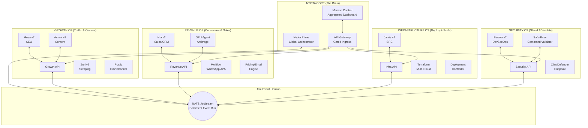

# NYOTA v2 — DISTRIBUTED DOMAIN ARCHITECTURE
## Enterprise Event-Driven Autonomous Business System

> **System Name:** Nyota v2 (Distributed)  
> **Version:** 2.1.0  
> **Classification:** Multi-OS Autonomous Enterprise Engine  
> **Architecture Pattern:** Event-Driven, Micro-Domain, Agent-Swarm  

---

## 1. STRATEGIC RECTIFICATION — THE DOMAIN MODEL

The initial architecture treated Nyota as an "SEO system with some scripts." The comprehensive codebase audit revealed the truth: **Nyota is a full business operations engine** managing $10M+ UGX in GPU inventory, executing multi-cloud deployments via Terraform, automating WhatsApp sales funnels, and enforcing endpoint security. 

Attempting to house this in a single mega-layer violates core systems engineering principles. 

**The Solution: The 4-OS Distributed Model.**
Nyota is no longer a monolith. It is an **Orchestration Core** managing four entirely decoupled Operating Systems. Each OS has its own database namespace, its own specialist agents, and its own distinct APIs. 

They communicate asynchronously over a persistent event bus. If the Revenue OS crashes, the Growth OS continues publishing content. If the Infrastructure OS is locked down, the Security OS continues scanning.

---

## 2. SYSTEM ARCHITECTURE 



---

## 3. EVENT-DRIVEN COMMUNICATION (NATS JetStream)

We abandon flat files and direct API calls between agents. We use **NATS JetStream** for persistent, at-least-once delivery event sourcing.

**Why NATS?** It supports publish/subscribe, point-to-point queues, and distributed key-value/object stores natively.

### Event Topic Taxonomy

```text
events.growth.content.drafted      -> (Consumed by: Nyota Core for approval)
events.growth.ranking.dropped      -> (Consumed by: Growth OS -> Musa)
events.revenue.lead.captured       -> (Consumed by: Revenue OS -> Nia / Moltflow)
events.revenue.inventory.sold      -> (Consumed by: Growth OS -> Pause Ads)
events.infra.deploy.requested      -> (Consumed by: Security OS -> Validate Command)
events.infra.deploy.failed         -> (Consumed by: Infra OS -> Jarvis -> Rollback)
events.security.threat.detected    -> (Consumed by: Infra OS -> Isolate Network)
```

**Example Cross-OS Flow (Lead to Sale):**
1. **Growth OS** publishes an SEO article on "RTX 3060 Price Uganda".
2. User clicks WhatsApp CTA.
3. **Moltflow** (in Revenue OS) receives the message and publishes `events.revenue.lead.captured`.
4. **Nia v2** picks up the event, queries the GPU Sourcing Agent for current inventory.
5. Nia v2 dynamically applies discounts via the E-Commerce Engine and replies to the user.

---

## 4. DOMAIN OS DEFINITIONS & AGENT ROLES

### I. GROWTH OS (Top of Funnel)
**Purpose:** Generate attention, rank on search engines, and distribute content.
**Data Store:** Qdrant (Semantic Search) + Postgres (Rankings/Content Schema)
**Subsystems:**
- `company-skills/gsc`, `company-skills/scrape`, `company-skills/postiz`, `company-skills/seo`
**Agent Roster:**
- **Musa v2 (SEO Strategist):** Monitors GSC/SERP data, generates content briefs.
- **Amani v2 (Content Creator):** Writes articles, formats schema, generates landing pages.
- **Zuri v2 (Data Crawler):** Scrapes competitor catalogs, parses SERPs.

### II. REVENUE OS (Bottom of Funnel)
**Purpose:** Close leads, manage physical inventory ($10M UGX GPUs), perform arbitrage, run CRM.
**Data Store:** Postgres (Transactional: Orders, CRM, Inventory) + Redis (Session states for chat)
**Subsystems:**
- `whatsapp-automation-a2a` (Moltflow), `nyota-team/email/` (Cart Abandonment), `nyota-team/discounts/` (Dynamic ROI)
**Agent Roster:**
- **Nia v2 (Sales/CRM):** Operates the WhatsApp conversational funnel, manages follow-ups.
- **GPU Sourcing Agent:** Monitors local hardware markets, determines optimal resale pricing.
- **Revenue Optimizer:** Manages A/B testing for pricing, triggers win-back emails.

### III. INFRASTRUCTURE OS (The Foundation)
**Purpose:** Provision servers, deploy code, maintain uptime.
**Data Store:** Local Filesystem (Terraform State), Prometheus (Metrics)
**Subsystems:**
- `opt-scripts/infra-recovery/` (Terraform AWS/Contabo/Hetzner), GitHub Actions integrations
**Agent Roster:**
- **Jarvis v2 (SRE / DevOps):** Monitors production health, writes Terraform `.tf` plan updates, manages deployment pipelines.

### IV. SECURITY OS (The Shield)
**Purpose:** Prevent destructive commands, block intrusions, audit system integrity.
**Data Store:** Postgres (Audit Logs), Redis (Fail2Ban jails/rate limits)
**Subsystems:**
- `skills/clawdefender`, `skills/bitdefender`, `opt/nyota/scripts/safe-exec.sh`
**Agent Roster:**
- **Baraka v2 (DevSecOps):** Parses auth logs, validates all cross-OS payload schemas, analyzes `safe-exec.sh` blocks, upgrades threat definitions.

---

## 5. REPOSITORY STRUCTURE (Monorepo with Bounded Contexts)

```text
nyota-enterprise/
├── core/                           # Nyota Core
│   ├── orchestrator/               # Nyota Prime Agent
│   ├── nats-config/                # Event bus streams definition
│   └── api-gateway/                # Centralized GraphQL/REST aggregation
│
├── os-growth/                      # Domain: Growth
│   ├── agents/                     # Musa, Amani, Zuri
│   ├── services/
│   │   ├── content-engine/         # Manages drafts/publishing
│   │   ├── crawler-pool/           # Playwright cluster
│   │   └── postiz-bridge/          # Social media sync
│   └── database/                   # Migrations for SEO data
│
├── os-revenue/                     # Domain: Revenue
│   ├── agents/                     # Nia, GPU Sourcing
│   ├── services/
│   │   ├── moltflow-whatsapp/      # A2A Conversational AI
│   │   ├── crm-engine/             # Lead management
│   │   └── discount-engine/        # Dynamic pricing algorithms
│   └── database/                   # Migrations for CRM tracking
│
├── os-infra/                       # Domain: Infrastructure
│   ├── agents/                     # Jarvis
│   ├── terraform/                  # Multi-cloud IaC definitions
│   └── deploy-controller/          # Versioned rollout management
│
├── os-security/                    # Domain: Security
│   ├── agents/                     # Baraka
│   ├── clawdefender/               # Malware/integrity scanner
│   └── execution-gate/             # safe-exec.sh + PR validation
│
└── shared/                         # Immutable boundaries
    ├── schemas/                    # Protobuf / Pydantic event definitions
    └── agent-framework/            # Shared LLM routing (Tier 1-4 fallback)
```

---

## 6. THE SAFETY & APPROVAL ENGINE (Micro-Domain Level)

Instead of a single bottleneck, safety is distributed. **Every OS runs its own execution boundary**, verified by the Security OS over NATS.

**Execution Flow:**
1. **Infra OS (Jarvis)** generates a Terraform plan to scale the crawler pool.
2. Jarvis publishes `events.infra.plan.proposed`.
3. **Security OS (Baraka)** listens, analyzes the plan via static analysis (e.g., `tfsec`).
   - If `FAIL`: Baraka publishes `events.security.plan.rejected`.
   - If `PASS`: Baraka publishes `events.security.plan.validated`.
4. **Nyota Core (Orchestrator)** listens for validations.
   - Core determines Risk Level. Terraform = `HIGH`.
   - Core fires a Telegram Webhook to the Human Operator.
5. Human replies `[APPROVE]`.
6. Core publishes `events.core.plan.approved`.
7. Infra OS executes deployment.

No domain trusts another domain. All execution commands must pass through `safe-exec.sh` middleware owned by the Security OS.

---

## 7. DATA PERSISTENCE & MEMORY OVERHAUL

**The distributed memory framework:**

1. **Global Semantic Memory (Qdrant)** 
   - Available as a read-only service to all domains. Contains company history, brand voice, past successful deployments, and competitor analysis.
2. **Domain-Specific Episodic Memory (Postgres)**
   - **Growth DB:** Tracks keyword histories and content states.
   - **Revenue DB:** Tracks lead funnels and WhatsApp conversation histories.
   - **Infra DB:** Tracks deployment rollbacks and uptime metrics.
3. **High-Speed Working Memory (Redis)**
   - State locks, rate limiting, and ephemeral task queues.

---

## 8. DEPLOYMENT ARCHITECTURE

The system is fully containerized, managed via Docker Swarm / Kubernetes (dictated by the existing Terraform scripts in `opt-scripts/infra-recovery`).

- **Base Layer:** The Terraform codebase provisions the raw VMs and configures the private networking.
- **Message Layer:** NATS JetStream is deployed as a resilient cluster spanning available nodes.
- **Application Layer:** Each OS builds into separate Docker images (`nyota-growth:latest`, `nyota-revenue:latest`).
- **Scaling:** The orchestrator can dynamically scale `os-growth` crawler pods without touching `os-revenue`.

---

## 9. SCALING AND OBSERVABILITY

Because the domains communicate via NATS, observability becomes absolute.

**Telemetry & Tracing (OpenTelemetry):**
- Every NATS message carries a `Trace-ID`.
- We can visualize the exact lifecycle of a user: `Clicked SERP (Growth OS)` -> `Opted-in to WhatsApp (Revenue OS)` -> `Triggered rate limit (Security OS)`.

**Scaling the Revenue OS:**
As GPU sales scale up to larger tech implementations, the CRM / WhatsApp engines can be scaled horizontally without risking the stability of the content generation systems.

---

*Nyota v2 (Distributed) — Decoupled, Resilient, Enterprise-Ready.*  
*Status: Ready for Domain-by-Domain implementation.*

