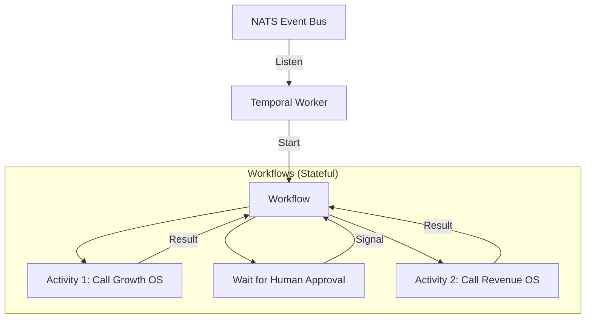

# Nyota v2 System Specification: Workflow Engine
## Stateful Orchestration & reliable Task Scheduling

### 1. Specification Overview
While NATS JetStream handles real-time decoupled communication, complex multi-step business logic requires a stateful orchestrator to manage retries, timeouts, and long-running waits. Nyota v2 adopts **Temporal** as the primary Workflow Engine.

Workflows are triggered by **NATS Events** and coordinate tasks across the domain Operating Systems.

---

### 2. Orchestration Pattern
Nyota uses the **Saga Pattern** for distributed transactions:
*   A "Starter" service listens for NATS triggers and initiates a Temporal Workflow.
*   Temporal manages "Activities" (which are typically OS API calls or NATS message signals).
*   If an activity fails, Temporal executes "Compensating Transactions" (Rollbacks).

---

### 3. Core Operational Workflows

#### 3.1 Workflow: Lead Conversion (The Profit Loop)
*   **Trigger:** `events.revenue.lead.captured`
1.  **Enrichment:** Call Growth OS API to find the source URL/Keyword attribution.
2.  **Scoring:** Agent (Nia) evaluates lead quality based on CRM history.
3.  **Assignment:** Moltflow initiates WhatsApp outreach.
4.  **Wait State:** Wait for 2 hours for response.
5.  **Follow-up:** If no response, send "Reminder" email via Revenue OS Email Engine.
6.  **Closure:** Record outcome in Revenue OS Database.

#### 3.2 Workflow: Content Generation Pipeline (The Traffic Loop)
*   **Trigger:** `events.growth.seo.brief_ready`
1.  **Research:** Zuri (Growth OS) crawls top 5 competing URLs for targeted keywords.
2.  **Drafting:** Amani (Growth OS) generates article markdown + assets.
3.  **Verification:** Baraka (Security OS) scans generated code/markdown for malicious URLs or scripts.
4.  **Approval Gate:** Nyota Core sends Telegram approval request with a preview link.
5.  **Deployment:** On approval, Git Gateway creates a PR; Content Publisher schedules live date.

#### 3.3 Workflow: Infrastructure Scaling (The Foundation Loop)
*   **Trigger:** `events.infra.scale.triggered` OR Cron (Scheduled load)
1.  **Plan:** Jarvis (Infra OS) generates a `terraform plan`.
2.  **Validation:** Security OS performs static analysis on the Plan file.
3.  **Pre-flight:** Check VPC budget/limits.
4.  **Application:** Execute `terraform apply`.
5.  **Health Check:** Wait 5 mins; verify service heartbeat.
6.  **Cleanup:** If health check fails, execute `terraform destroy` (Rollback).

#### 3.4 Workflow: Security Incident Response (The Shield Loop)
*   **Trigger:** `events.security.threat.detected`
1.  **Analysis:** Baraka (Security OS) classifies threat (e.g., Brute Force, SQLi).
2.  **Isolation:** Immediately publish `events.security.quarantine.active` (Nginx blocks IP).
3.  **Snapshot:** Call Infra OS to take immediate disk/DB snapshot.
4.  **Notification:** Escalate to Human Operator via Telegram (Critical Alert).
5.  **Report:** Generate incident post-mortem in Security OS logs.

#### 3.5 Workflow: Backup & Recovery (The Continuity Loop)
*   **Trigger:** Cron (Daily 02:00) OR Manual Request
1.  **Locking:** Signal all OSs to enter "Maintenance Mode" (suspend writes if necessary).
2.  **Dumping:** Infra OS executes SQL dumps and File backups.
3.  **Encryption:** Security OS encrypts payloads using Vault keys.
4.  **Transfer:** Upload to S3-compatible cold storage.
5.  **Verification:** Restore backup to a "Shadow Instance" and run heartbeat test.
6.  **Pruning:** Clean up old snapshots based on Retention Policy.

---

### 4. Workflow State & Monitoring

*   **Visibility:** All workflow statuses (Running, Completed, Failed) are exported to the **Mission Control Dashboard**.
*   **Persistence:** Temporal maintains the full history of every workflow, allowing for debugging "impossible" edge cases months later.
*   **Retry Policy:** 
    *   *Transient Failures:* High-frequency retries with exponential backoff.
    *   *Logic Failures:* Transition to "Human Intervention" state.

---

### 5. Integration Architecture

